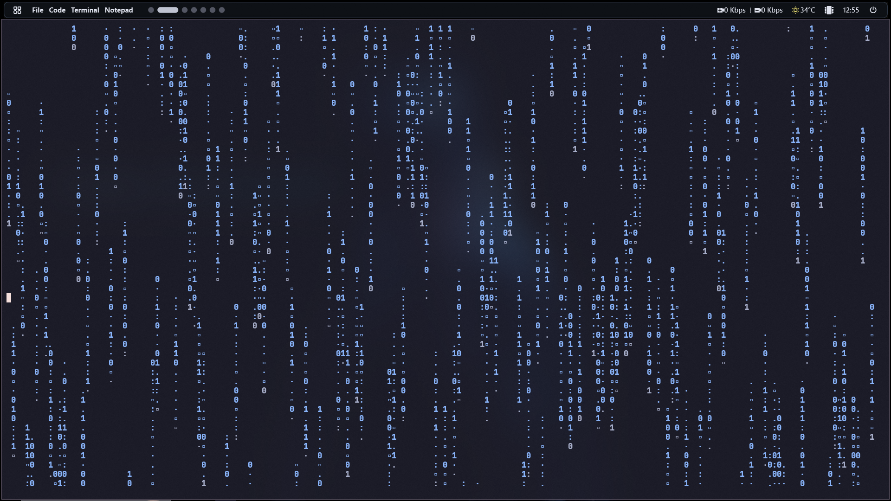
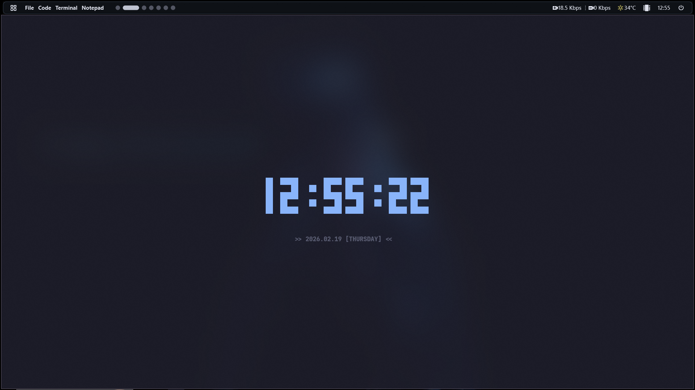
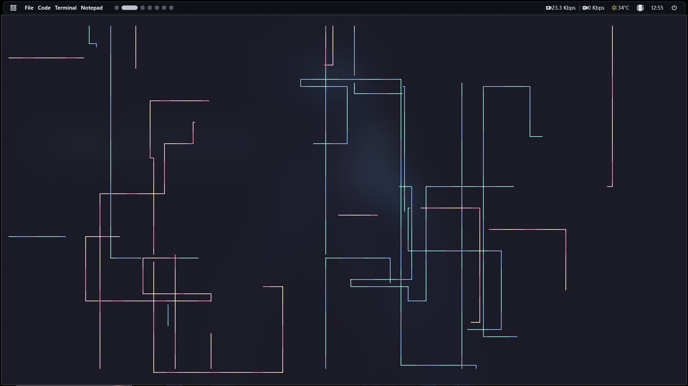
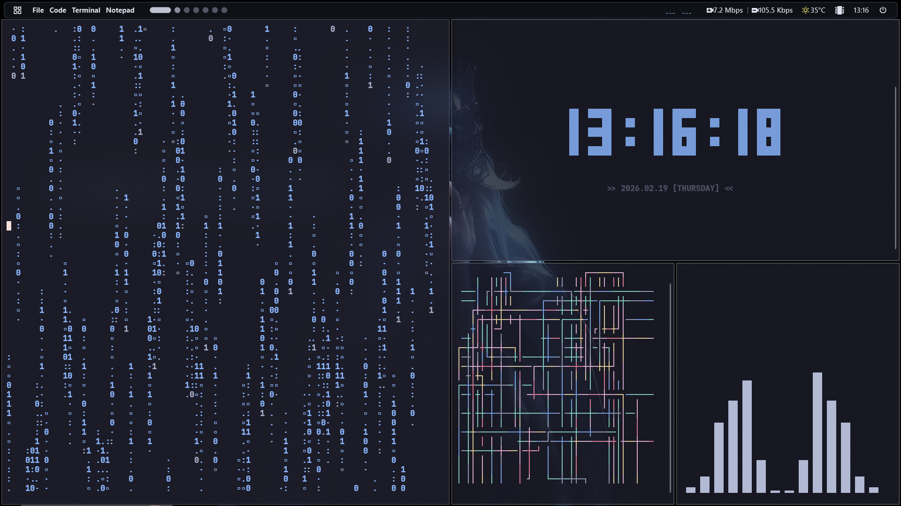
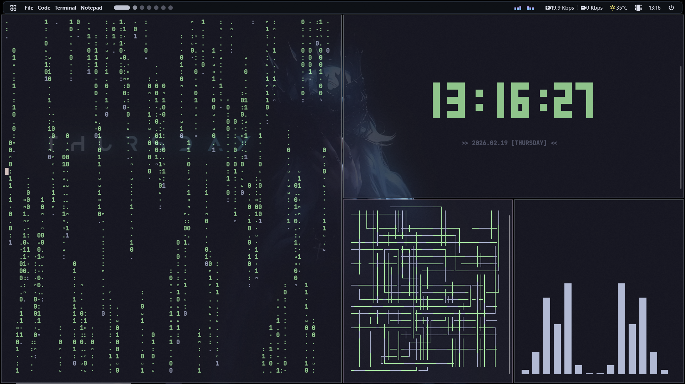
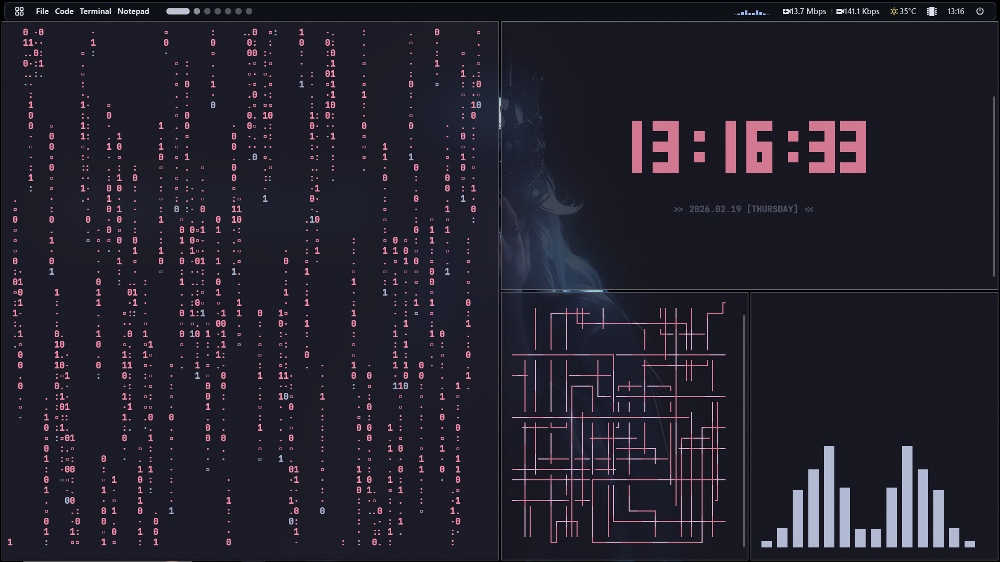
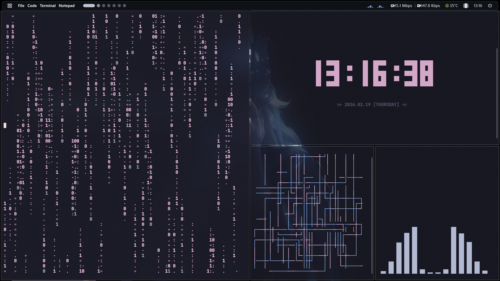
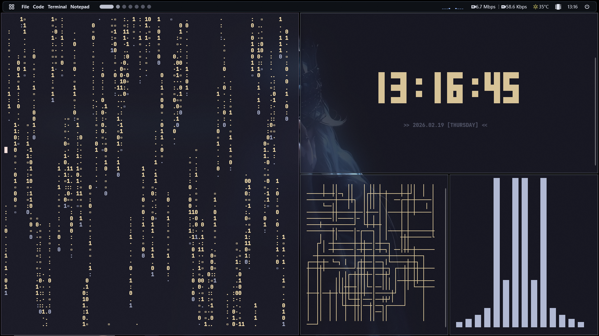

# <h1 align="center">🖥️ Terminal Visuals Suite</h1>

<p align="center">
  
  
  
</p>

> **Terminal Visuals Suite** is a collection of high-performance, lightweight terminal visualizers built specifically for the Windows Console using native Win32 API blitting.  
> Designed for speed, minimal resource usage, and real-time aesthetic customization.

---

## 📸 Visual Modules

| **Rusty Rain** | **Cyber Clock** | **Pipes** |
| :---: | :---: | :---: |
|  |  |  |

---

## ⚙️ Rendering Architecture

Unlike traditional console applications relying on standard output streams, this suite uses:

- **Native Win32 API Blitting**
- Direct console buffer manipulation
- Flicker-free frame updates
- High refresh rendering pipeline

This approach ensures smooth animation performance inside the Windows Console environment.

---

## ✨ Core Features

### 🎨 Dynamic Theme Engine
Switch between multiple color palettes in real-time:

- Deep Sea (Default)  
- Classic Matrix  
- Cyber Hell  
- Synthwave  
- Fallout  
- And more  

### ⚡ Ultra Low Resource Usage
Implemented using Python’s built-in `ctypes` (no external dependencies).  
Typical CPU usage remains under **1%**.

### 📦 Fully Portable
Distributed as standalone `.exe` files.  
No Python installation required.

---

## ⌨️ Interactive Controls

| Key | Action |
|------|--------|
| **→ (Right Arrow)** | Next color palette |
| **← (Left Arrow)** | Previous color palette |
| **R** | Reset simulation (Pipes only) |
| **Q / Esc** | Exit and restore console state |

---

## 🚀 Usage

Simply execute the corresponding `.exe` file.

No setup. No installation. Instant launch.

---

## 🖥️ PowerShell Integration

For quick access from anywhere, add aliases to your PowerShell `$PROFILE`:

```powershell
$Path = "D:\Program\Miniapp" # Update to your installation path
Set-Alias mx "$Path\RustyRain.exe"
Set-Alias cl "$Path\CyberClock.exe"
Set-Alias pp "$Path\PipesMatrix.exe"
```

After reloading PowerShell:

- `mx` → Rusty Rain  
- `cl` → Cyber Clock  
- `pp` → Pipes  

---

## 🎨 Theme Gallery

Switch themes in real time using the Arrow Keys (`→` / `←`).

| **Deep Sea (Default)** | **Classic Matrix** | **Cyber Hell** | **Synthwave** | **Fallout** |
| :---: | :---: | :---: | :---: | :---: |
|  |  |  |  |  |

---

## 🛠️ Technology Stack

- Python  
- ctypes (standard library only)  
- Native Win32 Console API  
- Blitting-based frame rendering  

---

## 📄 License

Specify your license here.

---

<p align="center">
  Built for terminal enthusiasts who believe the console deserves style.
</p>
